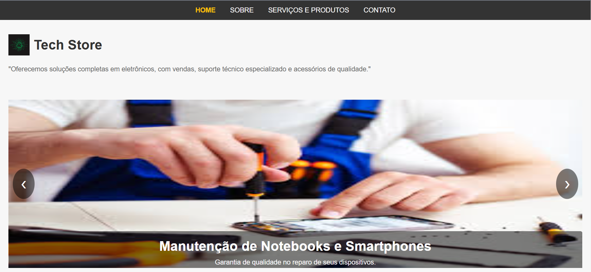
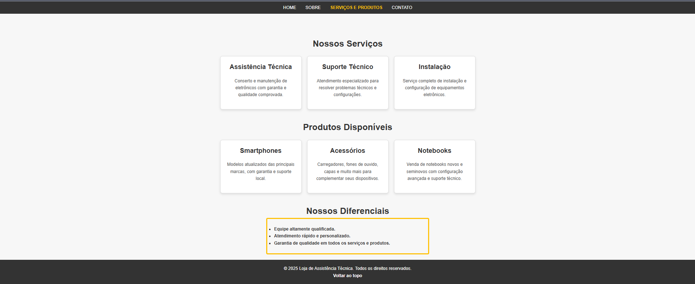
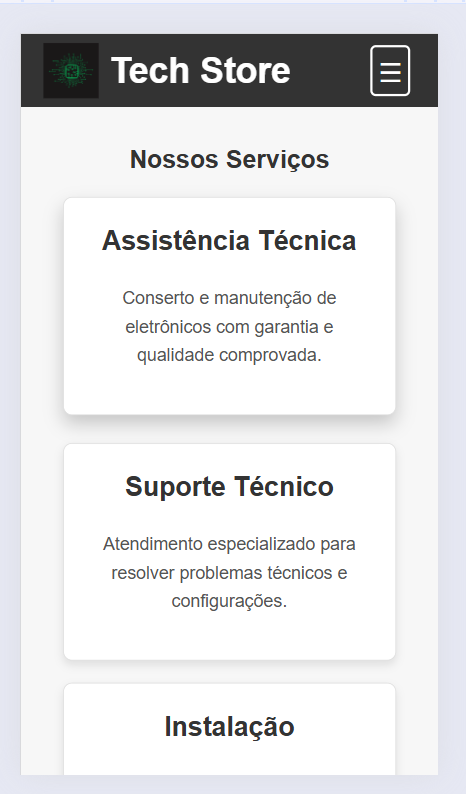

# Projeto Loja de Assistência Técnica Eletrônicos

Este projeto visa criar um website para uma **loja de assistência técnica** especializada em **venda, suporte e acessórios de eletrônicos**. O site foi desenvolvido com foco em uma experiência de usuário aprimorada, oferecendo serviços de qualidade, informações sobre produtos e a capacidade de suportar o atendimento ao cliente de forma eficiente. 

## Tecnologias Utilizadas

- **HTML:** Estruturação de conteúdo e páginas.
- **CSS:** Estilização e design responsivo.
- **Font Awesome:** Ícones para aprimorar a experiência visual do usuário.

## Objetivo do Projeto

O projeto tem como objetivo fornecer uma solução online para:

- **Venda de produtos eletrônicos e acessórios**
- **Suporte técnico especializado**
- **Informações detalhadas sobre os serviços oferecidos**

Este website é projetado para ser simples, funcional e acessível, atendendo às necessidades de uma loja de eletrônicos.

## Funcionalidades

O site oferece as seguintes funcionalidades:

- **Página Inicial (Home):** Apresentação da empresa e dos serviços oferecidos.
- **Sobre:** Informações sobre a empresa e missão.
- **Contato:** Formulário de contato para solicitação de serviços.
- **Sessão de Serviços:** Apresentação de categorias como "Venda de Produtos", "Suporte Técnico" e "Acessórios".
- **Barra de Navegação:** Facilitando a navegação entre as páginas do site.
- **Rodapé:** Com informações de direitos autorais e link para voltar ao topo da página.

## Imagens do Site

### Página Inicial (Desktop)
  
*Visualização da página inicial em dispositivos desktop.*

### Página Inicial (Mobile)
  
*Visualização da página inicial em dispositivos móveis.*

### Página de Serviços (Desktop)
  
*Visualização da seção de serviços em dispositivos desktop.*

### Página de Serviços (Mobile)
  
*Visualização da seção de serviços em dispositivos móveis.*

Caso as imagens não carreguem, certifique-se de que o diretório `images/` está na mesma pasta do arquivo README.md.


## Instruções de Uso

### Execução Local

1. **Clone o repositório** para sua máquina local:

```bash
git clone https://github.com/uchoacarlos22/loja-assistencia-tecnica.git
```

2. **Navegue até a pasta do projeto**:

```bash
cd loja-assistencia-tecnica
```

3. **Abra o arquivo `index.html`** no seu navegador:

```bash
index.html
```

O website estará disponível para visualização localmente no seu navegador.

## Como Contribuir

1. Faça um **fork** do repositório.
2. Crie uma branch para suas modificações: `git checkout -b minha-modificacao`.
3. Faça suas modificações e faça commit das mudanças: `git commit -am 'Adicionando nova funcionalidade'`.
4. Envie para o repositório remoto: `git push origin minha-modificacao`.
5. Abra uma **pull request**.

## Deploy no GitHub Pages

Este site está disponível para visualização pública via GitHub Pages:

[**Visite o site**](https://uchoacarlos22.github.io/assistencia-tecnica-eletronicos-loja/)

## Licença

Este projeto está licenciado sob a [MIT License](LICENSE).